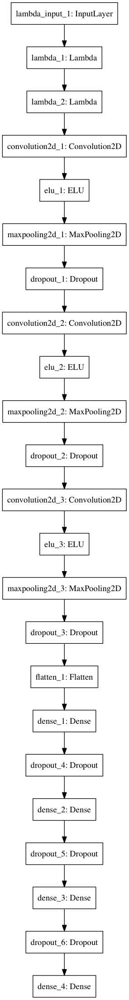

# CarND-P3-Simulator

## Overview

* [Introduction](#introduction)
* [Model Selection](#model-selection)
* [Model Diagram](#model-diagram)
* [Network Architecture](#network-architecture)
* [Augmenation And Recovery](#augmenation-and-recovery)
* [Dataset](#dataset)
* [Training](#training)
* [Prediction](#prediction)

## Introduction

The goal of the project is to train a self-driving car to predict its steering angle on the road by mimicking the behavior of human drivers.

The challenge is whether an End-to-End Deep Learning approach can be used to train a neural network to predict the steering angle given a lableled dataset.

The dataset consits of images captured while driving a car on a race track using a simulator; similar to a video game.

The difficulty in this task is the ability of the network to generalize given a limited dataset, without the need to exensively drive around the track at each position on the road.

There's an additional second track which has very different light and overall road conditions; such as uphill, shadows, as well as a different background.  The goal of generlization is to only use the data from the first track to be able to drive autonomously on both tracks.

## Model Selection

Model selection was made through a series of trials.  After much research on neural networks and specifically convolutional neural networks, most of the material recommends using a __3x3x32__ input layer, as well as __2x2__ max pooling and a __dropout__ at each layer.

Max pooling is of course useful in reducing the complexity of the output of each convlusion, while a __dropout layer__ between convolusions removes the denpendecy between them.

Expereince of trials showed that adding a __dropout layer__ after each convlusion, as well as dropping all of the __low angle images__ helps in steadying the car; the car doesn't continually drive left to center to right and back.

Expereince with previous projects helped in selection of the __FC__ layers.  The first __FC__ layer should have as many neurons as the training environment (__GPU__) can allow, followed by drastically smaller second and third __FC__ layers.  Powers of __2__ in the __FC__ layers are also very relevant to the optimization; reduing computional complexity.

## Model Diagram

## Network Architecture

> __Resizing__
> 
> Images are resized in the Generator.  Attempts were made to add a **lambda** resize layer but were unsuccessfull. 

The first two layers of the network perform __normalization__ and __trimming__.    Images passed to the input layer via the __Generator__ are resized to __(64, 64)__.

The model has __3__ layers of convolusions.  Each layer is __ELU__ activated and __(2x2) max pool'd__.  

There are 3 __Fully Connected__ layers; having __1024__, __128__, and __64__ neurons respectively.

A __dropout__ is added to every layer in the network with a __0.5__ keep probablity.  Regularization via a __dropout__ at the convolusional layers help to prevent interdepencency between convolusions, and improve the validity of the regression at the fully connected layers.

## Augmenation And Recovery

Left and right cameras are used to peform recovery.  The angle of the center camera is adjusted with a __+/- 0.15__ to reposition the car back to center.

The following augmentations and data manipulations are perfomed

1. All __zero__ angle images are dropped; however their __+/- 0.15__ equivelants are kept.
2. All images are resized to __(64, 64)__.
3. Images with angles greater than __0.5__; with the exception of the recovery images, are randomly shifted to the right and left.
  1. A random uniform of __+/-1__ decides which direction to shift; __right/left__ respectively.
  2. A random uniform of __10/50__ shifts the image in either direction using __cv2.getAffineTransform__
  3. The angle is __+/-__ adjusted by a factor of __0.004__ for each pixel.  This helps to train the model on additional positions of the car on the track.
4. Images with a angle greater than __0.15__ are flipped horizontally for additional training on right turns since the track is mostly left turns.

## Dataset

The Udacity.com dataset provided back in late November was used in addition to some training examples recorded via a __PS4__ controller at locations where there is a sharp turn.

## Training

Fifty epochs are used for training due to the size of the dataset after augmention and to prevent overfitting.  The weights of each epoch are saved individually and covnergence was selected based on the lowest validation loss; which was epoch __#47__.

## Prediction

The models's weights are saved at the end of each epoch.  The weights with the lowest __validation loss__ are used at prediction during autonomous simulator runs.

